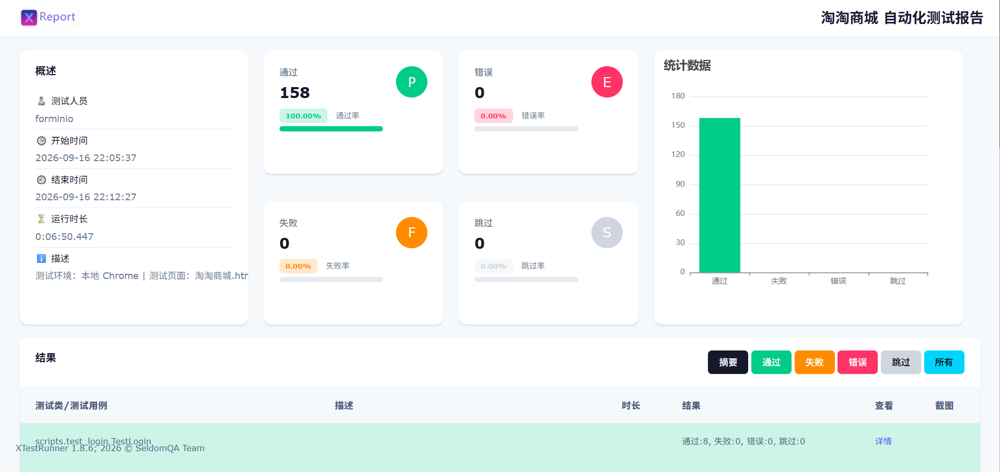
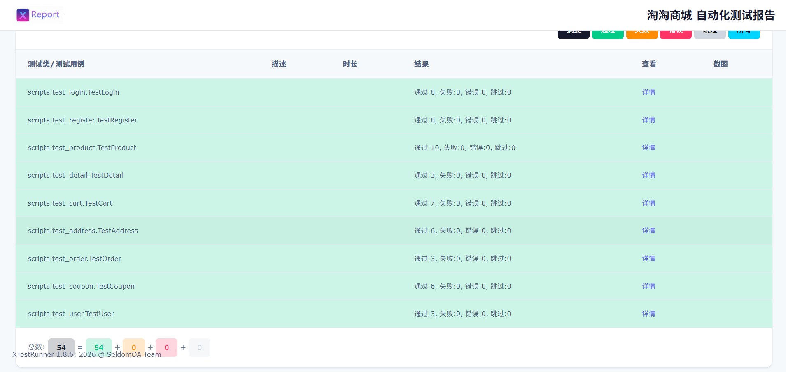

# 淘淘商城 Web 自动化测试

给「淘淘商城」这个本地 Demo（`demo/淘淘商城.html`）写的一套 UI 自动化，用 Selenium + unittest 把注册、登录、商品搜索、分页、详情、购物车、优惠券、下单、订单查询、商家店铺、消息中心、收货地址管理这条电商链路整个跑了一遍。数据从 JSON 读，用例之间互不依赖，最后用 XTestRunner 出一份带失败截图的 HTML 报告。

被测页面是单文件的 JS 状态机（40 个商品、10 家店铺、地址/消息/订单全部在内存里流转），不依赖后端，克隆下来就能跑。

## 环境

- Python 3.9+
- Selenium 4
- unittest + parameterized（数据驱动）
- XTestRunner（HTML 报告）
- Chrome 浏览器（Selenium 4.6+ 会自动管理 driver）

## 跑起来

```bash
pip install -r requirements.txt

# 全量跑，结束后在 reports/ 下生成报告
python main.py

# 只跑某个模块
python scripts/test_login.py
```

无头模式（CI / 服务器上没有显示器时用）：

```bash
# Windows PowerShell
$env:HEADLESS="1"; python main.py

# Linux / macOS
HEADLESS=1 python main.py
```

## 目录结构

```
TaotaoMall-AutoTest
├── main.py                    # 入口：装配用例 → 出报告 → 退出浏览器
├── base/
│   ├── get_driver.py          # 浏览器单例
│   ├── base.py                # find / click / input / 显式等待等基础封装
│   └── base_case.py           # 测试基类：拿驱动 + 每个用例前重置页面
├── common/
│   └── flows.py               # 登录、加购结算这些高频流程
├── page/
│   ├── __init__.py            # 所有元素定位器统一放这
│   └── page_*.py              # 每个页面一个类
├── scripts/
│   └── test_*.py              # 用例
├── data/
│   └── *.json                 # 用例数据
├── tools/
│   ├── read_json.py           # 读数据，转成命名参数
│   ├── price.py               # 金额格式化 / 解析
│   └── case_doc.py            # 报告里用例描述的处理
├── result/                    # 运行截图
├── reports/                   # 生成的 HTML 报告（不提交）
├── requirements.txt
└── demo/淘淘商城.html          # 被测页面
```

## 实现上在意的几个点

### 1. 浏览器只有一个实例

最早的写法是每个测试类各自起一个 Chrome，跑到后面会堆出好几个窗口，还时不时触发超时。后来把驱动收敛成一个类级单例，整个进程只构造一次，全部用例共享，收尾再统一 `quit`：

```python
class GetDriver:
    driver = None

    @classmethod
    def get_driver(cls):
        if cls.driver is None:
            options = Options()
            if os.getenv("HEADLESS") == "1":
                options.add_argument("--headless=new")
            cls.driver = webdriver.Chrome(options=options)
            cls.driver.get(cls.get_url())
        return cls.driver

    @classmethod
    def quit_driver(cls):
        if cls.driver is not None:
            cls.driver.quit()
            cls.driver = None
```

配合 `main.py` 在全部用例跑完后统一调一次 `quit_driver()`，一整轮测试 Chrome 起停各一次。

### 2. 显式等待的三种形态

这个框架里禁用了隐式等待，所有定位都走 `WebDriverWait`，但不同场景用的等待形态不一样——这是踩了几轮坑之后才定下来的：

**单个元素走 lambda，不堆 expected_conditions。** `EC` 链式条件写起来啰嗦，而单元素场景一个「元素出现在 DOM」的 lambda 就够，还能直接复用下标、属性这些原生操作：

```python
def base_find(self, loc, timeout=10, poll=0.5):
    return WebDriverWait(self.driver, timeout, poll_frequency=poll).until(
        lambda d: d.find_element(*loc)
    )
```

**alert 必须走 EC，lambda 抓不到。** 清空购物车用的是原生 `confirm()`，它不渲染成 DOM 节点，`find_element` 永远等不到。这类窗口要单独用 `EC.alert_is_present()` 接住再 `accept()`。

**列表等「第一个」，不等「全部」。** 前端是同步渲染，列表每次都是整块 `innerHTML` 原子替换，等到第一个元素出现，基本意味着整轮渲染已经完成：

```python
def base_finds(self, loc, timeout=30, poll=0.5):
    WebDriverWait(self.driver, timeout, poll_frequency=poll).until(
        lambda d: len(d.find_elements(*loc)) > 0
    )
    return self.driver.find_elements(*loc)
```

反过来，如果写成「等到元素数量等于 N」，渲染中间态就会误判超时。这套语义还有一个反向约束：**允许为 0 的元素不能走 `base_finds`**。消息中心的未读数在全部已读后就是 0，走 `base_finds` 会空等 30 秒——这类计数直接 `find_elements` 同步统计：

```python
def page_get_unread_count(self):
    """未读数可能为 0，不能走 base_finds（其等待至少出现一个元素），直接同步统计"""
    return len(self.driver.find_elements(*page.sys_msg_unread))
```

### 3. 失败自动取证

用例失败时不用在每个方法里手写 `try/except` 截图。报告环节会检测到失败用例持有的 WebDriver，把失败瞬间的页面自动截成 base64 内嵌进 HTML 报告——无头模式下同样生效，所以 CI 里跑挂了也能拿到现场。

排障顺序就变成：先看报告里的截图确认页面状态，再对照堆栈定位是断言错了还是页面渲染错了，大部分问题第一眼就能定位。

### 4. 金额断言不写死

价格一旦硬编码，前端一改价测试就「假绿」。所以期望值都是运行时从页面读出来再算，跟前端 `formatPrice` 用同一套千分位规则：

```python
def format_price(n):                 # 8999 -> '8,999'
    return f"{int(n):,}"

def parse_price(text):               # '¥8,999' -> 8999
    return int("".join(ch for ch in str(text) if ch.isdigit()))
```

```python
def test_order(self, receiver, phone, address, remark, index):
    unit = self.product.page_get_product_price(index)   # 运行时读价
    checkout(self.driver, index)
    self.address.page_fill_address(receiver, phone, address, remark)
    self.address.page_click_submit()
    self.assertIn(format_price(unit), self.order.page_get_order_amount())
```

优惠券也抽成了一张规则表，测试端照着门槛和减免复算一遍应付金额再断言，页面的 `COUPONS` 和测试的 `COUPON_RULES` 必须同源维护，一边改了另一边跑不过，防止规则漂移：

```python
COUPON_RULES = {"n": (0, 0), "a": (5000, 500), "b": (3000, 200), "c": (1000, 50)}

def test_coupon(self, index, coupon):
    unit = self.product.page_get_product_price(index)
    threshold, discount = COUPON_RULES[coupon]
    payable = unit - discount if unit >= threshold else unit
    ...
    self.assertIn(format_price(payable), self.order.page_get_order_amount())
```

### 5. 用例之间隔离

因为被测页面是单文件的 JS 状态机，购物车、登录态、未读消息都放在内存里，前一条用例很容易污染后一条。处理方式是在每个用例的 `setUp` 里重载页面，把 JS 状态整体清零：

```python
class BaseCase(unittest.TestCase):
    @classmethod
    def setUpClass(cls):
        cls.driver = GetDriver().get_driver()   # 复用同一个浏览器

    def setUp(self):
        self.driver.get(GetDriver().get_url())   # 每次重载，重置 JS 状态
```

### 6. 分层职责与流程复用

登录、加购结算在好几条用例里反复出现，抽成函数放 `common/flows.py`，用例里两行就能进到结算页：

```python
def login(driver, username="admin", password="123456", captcha="8888"):
    page = PageLogin(driver)
    page.page_click_login_link()
    page.page_login(username, password, captcha)
    return page

def checkout(driver, index=0):
    PageProduct(driver).page_add_cart(index)
    PageCart(driver).page_click_nav_cart()
    PageCart(driver).page_click_checkout()
```

页面对象同样在收敛公共行为：`PageModal` 一套弹窗操作同时服务地址编辑、消息详情、协议条款、页脚信息四类场景；`PageAddress` 里「默认地址排序、设为默认、删除二次确认」这类状态流转对用例层只暴露成一行调用；未登录拦截的反向用例统一依赖一个 `assert_toast` 断言「请先登录」提示，而不是各自去等元素。

被遮挡点不动的元素，再兜底用 JS 强点一下，避免 `ElementNotInteractableException` 硬砸出来：

```python
def base_js_click(self, loc):
    el = self.base_find(loc)
    self.driver.execute_script("arguments[0].click();", el)
```

## 测试覆盖

| 模块 | 文件 | 说明 |
| --- | --- | --- |
| 登录 | test_login.py | 正确 / 错误凭证、多组校验、退出登录 |
| 注册 | test_register.py | 表单校验、注册成功自动登录 |
| 商品 | test_product.py | 十大分类命中数量、关键词搜索、无结果场景 |
| 分页 | test_pagination.py | 页码切换、首页 / 末页数量、上一页下一页、单页分类 |
| 详情 | test_detail.py | 名称 / 价格 / 库存、店铺入口 |
| 购物车 | test_cart.py | 加购、数量增减、删除、清空、合计 |
| 地址 | test_address.py | 结算页收货信息表单校验 |
| 地址管理 | test_address_manage.py | 新增 / 编辑 / 删除、默认地址排序、弹窗二次确认 |
| 优惠券 | test_coupon.py | 满减券折后金额、未达门槛不打折 |
| 下单 | test_order.py | 完整下单流 + 动态金额校验 |
| 订单 | test_user.py | 空订单、下单后查询订单 |
| 店铺 | test_shop.py | 店铺详情、商品进店、返回首页、未登录拦截 |
| 卖家中心 | test_seller_center.py | 全部商家罗列、进入店铺、未登录拦截 |
| 个人中心 | test_user_center.py | 用户信息、订单 / 地址入口、退出登录 |
| 消息中心 | test_messages.py | 系统消息、未读徽章、已读状态、客服自动回复 |
| 信息页与协议 | test_info_modals.py | 页脚五个链接、用户协议 / 隐私政策弹窗 |
| 未登录权限 | test_unauthorized.py | 六大入口拦截、加购 / 立即购买拦截、注册入口生命周期 |

## 运行结果

全量跑完生成的报告长这样，自带 ECharts 统计图和逐条用例结果，失败会直接附上截图：





## 附录：几个核心文件

<details>
<summary>base/get_driver.py</summary>

```python
import os
from pathlib import Path

from selenium import webdriver
from selenium.webdriver.chrome.options import Options


class GetDriver:
    """浏览器驱动单例：整个测试进程只创建一次 Chrome，避免反复启停。"""

    driver = None
    url = None

    @classmethod
    def get_driver(cls):
        if cls.driver is None:
            options = Options()
            if os.getenv("HEADLESS") == "1":
                options.add_argument("--headless=new")
                options.add_argument("--disable-gpu")
                options.add_argument("--window-size=1920,1080")

            cls.driver = webdriver.Chrome(options=options)
            if os.getenv("HEADLESS") != "1":
                cls.driver.maximize_window()

            cls.driver.get(cls.get_url())
        return cls.driver

    @classmethod
    def get_url(cls):
        if cls.url is None:
            base = Path(__file__).resolve().parent.parent
            cls.url = (base / "demo" / "淘淘商城.html").as_uri()
        return cls.url

    @classmethod
    def quit_driver(cls):
        if cls.driver is not None:
            cls.driver.quit()
        cls.driver = None
```

</details>

<details>
<summary>tools/read_json.py</summary>

```python
import json
from pathlib import Path

from parameterized import param


BASE_DIR = Path(__file__).resolve().parent.parent
DATA_DIR = BASE_DIR / "data"


def read_json(file_path):
    """读取 JSON 文件，返回字典或列表"""
    path = Path(file_path)
    if not path.exists():
        raise FileNotFoundError(f"JSON 文件不存在: {file_path}")
    with open(path, "r", encoding="utf-8") as f:
        return json.load(f)


def get_data(filename):
    """读取 data/ 下指定 JSON 文件，转成 parameterized 所需的命名参数列表。"""
    json_path = DATA_DIR / f"{filename}.json"
    data = read_json(json_path)

    if not isinstance(data, list):
        raise TypeError(f"数据文件须为 JSON 数组: {json_path}")

    return [param.explicit(kwargs=item) for item in data]
```

</details>

<details>
<summary>common/flows.py</summary>

```python
"""高层业务流程封装，供测试用例复用，消除重复代码。"""

from page.page_login import PageLogin
from page.page_product import PageProduct
from page.page_cart import PageCart

DEFAULT_USER = "admin"
DEFAULT_PASSWORD = "123456"
DEFAULT_CAPTCHA = "8888"


def login(driver, username=DEFAULT_USER, password=DEFAULT_PASSWORD, captcha=DEFAULT_CAPTCHA):
    """点击登录入口并完成登录，返回登录页对象。"""
    page = PageLogin(driver)
    page.page_click_login_link()
    page.page_login(username, password, captcha)
    return page


def checkout(driver, index=0):
    """商品列表加购第 index 个商品 → 进入购物车 → 跳转结算页。"""
    PageProduct(driver).page_add_cart(index)
    PageCart(driver).page_click_nav_cart()
    PageCart(driver).page_click_checkout()
```

</details>